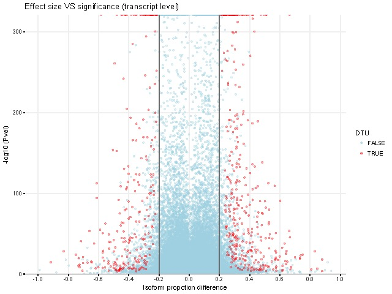
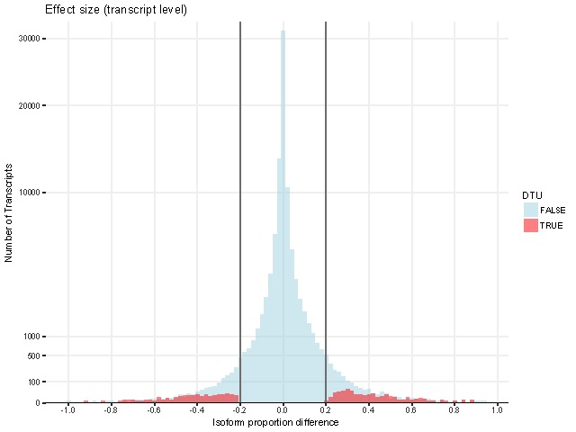
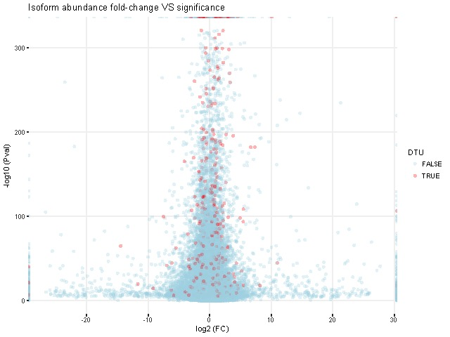

***


Set up an example.


```r
# Simulate some data.
simdat <- sim_boot_data(clean=TRUE) 
# For convenience let's assign the contents of the list to separate variables
mycond_A <- simdat[[2]]   # Simulated bootstrapped data for one condition.
mycond_B <- simdat[[3]]   # Simulated bootstrapped data for other condition.
myannot <- simdat[[1]]    # Transcript and gene IDs for the above data.

# Call DTU
mydtu <- call_DTU(annot= myannot, verbose= FALSE,
                  boot_data_A= mycond_A, boot_data_B= mycond_B,
                  dprop_thresh=0.1, qboot=TRUE, rboot=FALSE)
```


***


# Visualisation of results


The RATs output object provides a host of information and we encourage users to familiarize themselves with it. 
But a good plot is worth a thousand numbers. RATs provides a non-exhaustive set of basic visualisation options for the results.

The plotting functions return a `ggplot2` object. You can just `print()` it, or assign it to a variable, further customise it with standard [ggplot2](http://ggplot2.org) operations, or even pass it on to other viewing functions, like `plotly::ggplotly()`.

## Inspection of a given gene

### Isoform abundances

This is a very useful function for inspecting a gene of interest. It enables quick visual evaluation of the dispersion of the replicate measurements, the magnitude of the absolute and proportion changes, the presence of outliers, and the consistency among the replicates.


```r
# Grouping by condition (DEFAULT):
plot_gene(mydtu, "MIX", style="bycondition")
```

<!-- -->

* The top two facets show the absolute abundances (counts) of the isoforms as supplied in the input. 
* The bottom two facets show the correspondng relative abundances (proportions). 
* The facets on the left ocrrespond to one condition, the facets on the right correspond to the other condition.
* The boxplots describe the abundance distribution of each isoform across replicates. 
* The actual abundance measurements are overlayed as points.
* The set of abundances obtained in each replicate is shown by the lines connecting the points. This highlights the level of consistency between the replicates. 
* The presence of DTU for each transcript is encoded in the fill and shape of the abundance points.
* The points and lines are placed slightly off-centre to prevent replicates masking one another when the measurements are very similar. 
* The colours of the replicates are recycled between the two conditions. So in the example, there are 4 samples: controls-1, controls-2, patients-1 and patients-2.

When there are many replicates or many isoforms, it may be preferable to group abundances by isoform, making individual comparisons easier:


```r
# Grouping by isoform:
plot_gene(mydtu, "MIX", style="byisoform")
```

<!-- -->

### Customisation of the abundances plot

#### Change information layers

The `fillby`, `colourby` and `shapeby` parameters of `plot_gene()` can be respectively used to control which information layers
are encoded as fill, line/point colour, and point shape. Possible values are `c("isoform", "condition", "DTU", "none", "replicate")`.
Be aware that some combinations of plot style and information layers are not possible.

#### Change colour code

Colour codes can be customised by specifying new values to the corresponding parameters of `plot_gene()`:

* `isofcolvec` - Colour vector for isoform highlighting. Used to build a colorRampPalette.
* `dtucolvec` - Colour vector for DTU highlighting.
* `condcolvec` - Colour vector for condition highlighting.
* `replcolvec` - Colour vector for replicate highlighting. Used to build a colorRampPalette.
* `nonecol` - Colour to use when no colour coding is wanted.

An example of a colour vector, using standard R colour aliases, would be `c('blue', darkred', 'gold')`.


### Structure of the given gene

With the use of the third-party Bioconductor package [ggbio](https://bioconductor.org/packages/release/bioc/html/ggbio.html), one can plot gene models from `GRanges`/`GRangesList` objects. This can be useful in interpreting transcript expression and DTU.

Therefore RATs offers a helper function to create an appropriate collection of `GRanges`/`GRangesList` objects from a GTF file. The collection is structured as a list, indexed by the GTF `gene ID` values. Each list element is a `GRangesList` object with the annotated transcripts for that gene.


```r
models <- annot2models('/my/annotation/file.gtf')
library(ggbio)
# This will plot the structure of all isoforms for the given gene ID.
autoplot(models[['mygeneID']])
```

For more options and more refined plots, refer to the `ggbio` documentation.


## Overview plots

Our simulated dataset is too small to properly demonstrate what these plots might look like.
So, instead, each one is accompanied by a static image of the plot created with a real and much larger dataset.

Possibly the most common plot in differential expression is the volcano plot, which plots the effect size against 
the statistical significance. The thresholds are also shown, although the default significance threshold of 0.05
is very low (hint: no lines are drawn for the axes).


```r
# Proportion change VS transcript-level significance. Each point is a transcript
plot_overview(mydtu, type="tvolcano")

# This can also be plotted for genes, by using the largest isoform effect size as proxy.
plot_overview(mydtu, type="gvolcano")
```

This is what these look like on a larger dataset:


You can also get density histograms for the volcanos (the Y axis is square-root compressed):


```r
# Distribution of proportion change.
plot_overview(mydtu, type="dprop")

# Distribution of largest isoform proportion change per gene.
plot_overview(mydtu, type="maxdprop")
```

This is what these look like on a larger dataset:


Although fold-changes of transcript expression are not tied to DTU, you can plot the traditional FC volcano and the relationship between FC and proportion change. Bear in mind that the FCs will be based on the abundances provided as input, *without any adjustments* such as library size normalization.


```r
# Proportion change VS transcript-level significance. Each point is a transcript
plot_overview(mydtu, type="fcvolcano")

# This can also be plotted for genes, by using the largest isoform effect size as proxy.
plot_overview(mydtu, type="fcVSdprop")
```




## Diagnostic plots

Currently there is only one plot type in this category.


```r
# Pairwise Pearson's correlations among samples.
plot_diagnostics(mydtu, type='cormat') # Default type.
```

<!-- -->

What you want to see here, is a nice separation between the samples of different conditions.
Anomalies in this plot may indicate batch effects or mislabelled samples.


## Interactive plots

If you prefer picking points from a plot rather than sorting through tables, the gene-level volcano plot is also available through 
an interactive `shiny` app, that pulls up the relevant `Gene` and `Transcript` results and the isoform abundance plot 
for any volcano point you select.


```r
# Start the interactive volcano plot.
plot_shiny_volcano(mydtu)
```

1. Hovering over a point (or cluster of points) will show the gene IDs and some summary info.
2. Clicking on a point will display the all the available information calculated for the gene and its isoforms, as
well as draw the isoform abundance plot for the gene.

When you finish exploring the volcano plot, close the popup window or stop the shiny runtime in order to return to your R terminal.


***


# Contact information

The `rats` R package was developed within [The Barton Group](http://www.compbio.dundee.ac.uk) at [The University of Dundee](http://www.dundee.ac.uk)
by Dr. Kimon Froussios, Dr. Kira Mourão and Dr. Nick Schurch.

To **report problems** or **ask for assistance**, please raise a new issue [on the project's support forum](https://github.com/bartongroup/Rats/issues).
Providing a *reproducible working example* that demonstrates your issue is strongly encouraged to help us understand the problem. Also, be sure 
to **read the vignette(s)**, and browse/search the support forum before posting a new issue, in case your question is already answered there.

Enjoy!


